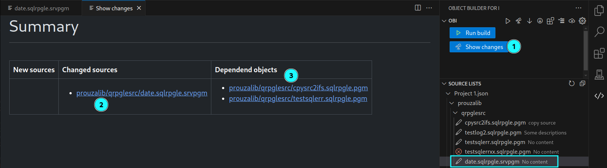
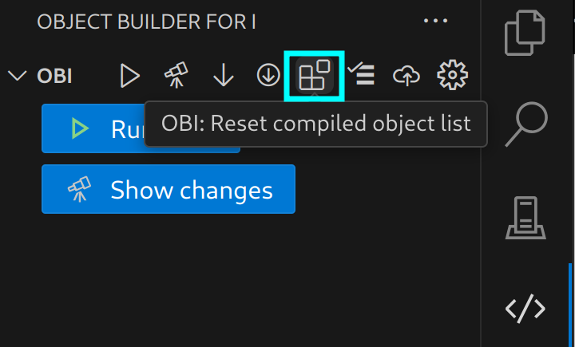

# OBI README

Object builder for i (OBI) is an automatic build tool.

> Notice:
Currently only the Beta version is available.
Final release will be available soon.


## Features

* Individual source lists with source descriptions
  
  
* Check for changes
  
  It checks all sources which have changed since last compilie.  
  The hash value of the source will be used to check if it has changed.
  
* Check for dependencies
  
  All objects which depend on the changed source will also be compiled (in correct order)

  E.g. if a table or view has changed, all objects which use them will be compiled too

  


* Compile in correct order
  
  Tables before programs etc. based on the dependency list


* See which objects has been compiled and their details  
  Each task has its own:
  
  * joblog
  * spool file
  * error output

  


## Requirements

* On IBM i SSH is necessary  
  https://github.com/andreas-prouza/ibm-i-build/blob/main/docs/pages/SSH.md
* You need to clone the OBI project on your IBM i:  
  https://github.com/andreas-prouza/obi


## Release Notes

### 0.1.8 Beta

Beta release of OBI


---

## The concept

The idea is to work with your **sources locally** on your PC.  
Only for compile process, sources will be synchronised to the IFS.

Because you work locally, you need to sync your changes with other developers.
--> This is where **git** came in.


## Following steps you need to do

1. Get your Sources to IFS (to your project folder)
2. Create a git repository
3. Add the project folder to this git repository
4. Open the OBI extension in vscode
   You will see the welcome screen
    
5. Initialize the project with OBI
   A new folder ```.obi``` will be created including some initial config files.
6. Take a look into the config (server, user, ifs locations, ...)
     
     
     
     >User specific settings (like IFS remote directory, SSH password, ...) can be defined/overwritten in the ```User configuration``` area.
7. Check if it works with ```Show changes```
     
     You should see a list of sources, ready to compile.
8. Reset the compiled object list
   
   From now, the ```Show changes``` action only shows changed sources.
9.  When you are motivated, you can create a dependency list.
    With a dependency OBI creates the correct build order and includes all dependend objects. (E.g. for SRVPGM, files, ...)
    (See [dependency list](https://github.com/andreas-prouza/ibm-i-build-obi/blob/main/docs/pages/configuration.md#etcdependencytoml))
10. Sync all changes to your git repo

If no OBI config could be found, you will see the welcome screen:


## For more information

* [OBI: the build tool running on IBM i](https://github.com/andreas-prouza/obi)
* [OBI: detailed description](https://github.com/andreas-prouza/ibm-i-build-obi)
* [OBI: vscode extension](https://github.com/andreas-prouza/obi-extension)

**Happy ever after!**
