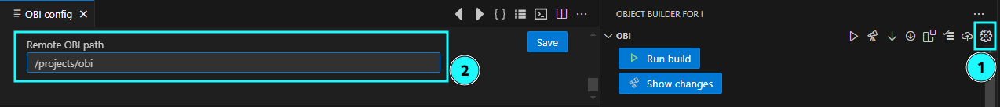

# OBI README

Object builder for i (OBI) is an automatic build tool.

<p align="center">
  <a href="https://www.buymeacoffee.com/prouza"></a>
</p>

> Notice:
Currently only the Beta version is available.
Final release will be available soon.


## Features

* Use different profiles for your build settings (LIBL, target lib, build cmd, ...)
  
  

* Individual source lists
  
  

* Open source filter as table  
  There you can filter, sort

  

* Maintain source descriptions
  
  
  
* Check for changes
  
  It checks all sources which have changed since last compilie.  
  The hash value of the source will be used to check if it has changed.
  
* Check for dependencies
  
  All objects which depend on the changed source will also be compiled (in correct order)

  E.g. if a table or view has changed, all objects which use them will be compiled too

  


* Compile in correct order
  
  Tables before programs etc. based on the [dependency list](asserts/docs/dependencies.md)


* See which objects has been compiled and their details  
  * Command
  * joblog
  * spool file
  * error output

  


## Requirements

* On IBM i SSH is necessary  
  https://github.com/andreas-prouza/ibm-i-build/blob/main/docs/pages/SSH.md
* You need to clone the OBI project on your IBM i:  
  https://github.com/andreas-prouza/obi


---

## The concept

The idea is to work with your **sources locally** on your PC.  
Only for compile process, sources will be synchronised to the IFS.

Because you work locally, you need to sync your changes with other developers.
--> This is where **git** came in.


## Following steps you need to do

### First start

1. On your PC create an empty project folder
2. In vscode open that folder
3. Switch to the OBI view
   
   You will see the welcome screen.  
   Here you can initialize the project with OBI

    

   This creates a new folder ```.obi``` including some initial config files

4. Then OBI opens the config where you need to define some mandatory settings (server, user credentials, ifs locations, ...)
   
     

     >**```Project configuration```** contains settings shared with all team members

     >The **```User configuration```** area overwrites the ```Project configuration``` with the users specific settings (like SSH user & password, ...).

     When you finished configuration, save it and your project gets reloaded automatically.

5. Now, OBI is ready. It comes with an sample source in the ```Source Filters``` area
   


6.  On your IBM i
    Clone OBI from GitHub somewhere in the IFS and run the setup script.
    
    ```sh
    git clone https://github.com/andreas-prouza/obi /ifs/path/obi
    cd /ifs/path/obi
    ./setup.sh
    ```

    (Copy the path in your project config)

    


### Start migrating your source to OBI

1. **GIT**  
  If you are working in a Team you should use git
   1. Create a git repository (on your IBM i, gitlab, github, gitea, ...)
   2. Add the project folder to this git repository
   3. Clone the git repo on your PC

2. **Copy source to IFS**  
   Get your Sources to IFS (to your project folder)
   You can use my RPG program to get this job done: 
   https://github.com/andreas-prouza/ibm-i-build-obi/blob/main/src/prouzalib/qrpglesrc/cpysrc2ifs.sqlrpgle.pgm

3. Reset the compiled object list
   OBI can check which sources have changed and need to be built.  
   Therefore, a hash value is stored for each source.
   
   

   From now, the ```Show changes``` action only shows changed sources.

4.   When you are motivated, you can create a dependency list.
    
     With a dependency list OBI creates the correct build order and includes all dependend objects. (E.g. for SRVPGM, files, ...)
     (See [dependency list](https://github.com/andreas-prouza/ibm-i-build-obi/blob/main/docs/pages/configuration.md#etcdependencytoml))
    
5.  Sync all changes to your git repo

If no OBI config could be found, you will see the welcome screen:


## For more information

* [Source dependencies](asserts/docs/dependencies.md)
* [SSH setup](asserts/docs/ssh.md)
* [OBI: the build tool running on IBM i](https://github.com/andreas-prouza/obi)
* [OBI: detailed description](https://github.com/andreas-prouza/ibm-i-build-obi)
* [OBI: vscode extension](https://github.com/andreas-prouza/obi-extension)

**Happy ever after!**
