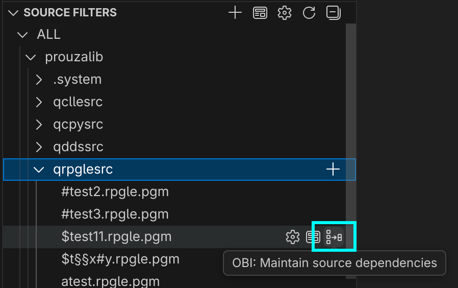
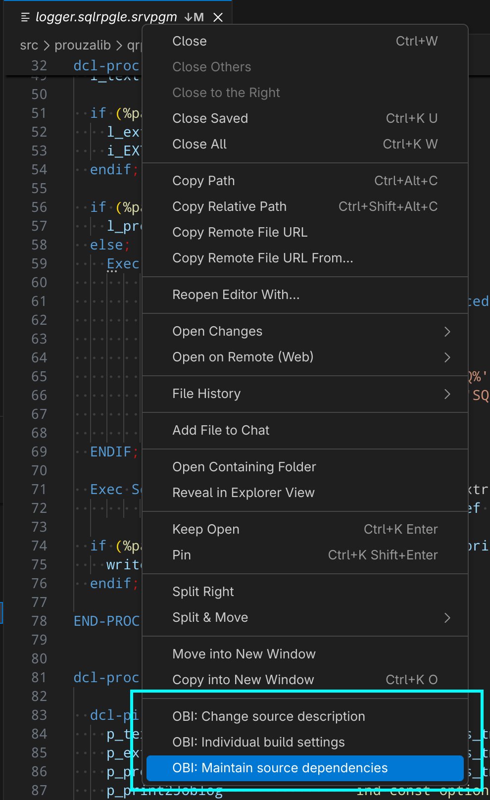
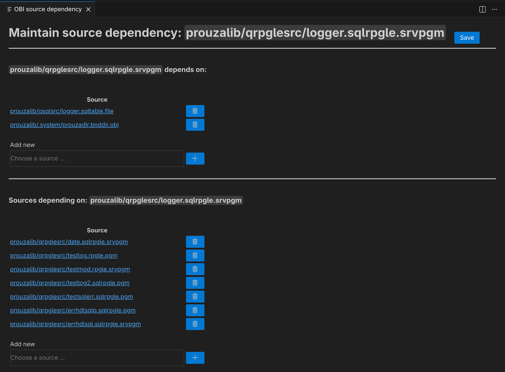

# General

You can define dependencies between sources.

# Storage

These dependencies are stored in `.obi/etc/dependency.json`.

The structure is quite simple:

```json
{
  "pgm1.rpgle.pgm" : ["screen1.dspf.file", "table1.pf.file"],
}
```

# Maintenance dependencies

You can open the maintenance in 2 ways:

* In source filters

  

* Via context menu of the opened source

  

This opens the dependency menu

